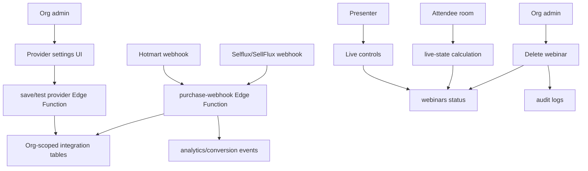

# Sales Provider Integrations, Live Webinar Fix, and Webinar Deletion Design

**Spec**: `.specs/features/hotmart-live-delete/spec.md`
**Status**: Draft

## Architecture Overview

The feature uses the existing Supabase-first architecture:

- React dashboard handles provider configuration UI and live/delete controls.
- Supabase tables store organization-scoped provider settings, mappings, normalized events, and audit logs.
- Supabase Edge Functions handle Hotmart and Selflux/SellFlux credential testing and webhook ingestion because secrets must stay server-side.
- Public webinar pages keep using RPC-based public reads and client-safe room rendering.



## Code Reuse Analysis

| Existing Pattern | How to Use |
| --- | --- |
| Organization context | Resolve the active `org_id` for provider settings, mappings, live controls, and deletes. |
| Supabase context/client | Reuse existing client access patterns for authenticated dashboard reads and mutations. |
| Audit helper | Reuse for provider credential changes, live start/end, and deletion actions. |
| Public webinar RPC pattern | Keep public pages on one-webinar-by-slug RPCs instead of table-wide public reads. |
| Existing analytics event model | Record mapped provider purchases as conversion/sale analytics without creating a parallel analytics system. |
| Existing dashboard editor tab pattern | Add integrations and/or live controls using current card/form patterns. |
| Existing provider specs | Reuse the adapter/factory approach already planned for other provider families in repo specs. |

## Integration Points

| System | Integration Method |
| --- | --- |
| Hotmart API auth | Server-side OAuth/client credentials test using org credentials. |
| Hotmart webhooks | Public Edge Function endpoint validates Hottok and persists normalized event. |
| Selflux/SellFlux API auth | Server-side API Key test using org credentials, pending exact docs/payload confirmation. |
| Selflux/SellFlux webhooks | Same public Edge Function with provider adapter validation according to confirmed docs. |
| Supabase RLS | Tables include `org_id`; RLS allows only org members to read/manage their own records. |
| Webinar room | Reusable live-state helper decides waiting/player/ended/unavailable state. |
| Audit log | Create audit events for credential updates, live state changes, and delete. |

## Components

### Provider Settings UI

- **Purpose**: Let org admins configure Hotmart and Selflux/SellFlux credentials, webhook secrets, active status, and product mappings.
- **Interfaces**:
  - Loads masked integration status and mappings for current org.
  - Saves credentials through a server-side function.
  - Tests credentials through a server-side function.
  - Creates/updates/disables product-to-webinar mappings.
- **Dependencies**: authenticated user, current org, Supabase Edge Function.
- **Reuses**: dashboard form/card patterns and org context.

### Provider Credential Service

- **Purpose**: Validate, store, rotate, and test provider credentials without exposing secrets to the frontend.
- **Interfaces**:
  - `saveProviderCredentials(orgId, provider, payload)`
  - `testProviderCredentials(orgId, provider)`
  - `getProviderIntegrationStatus(orgId, provider)`
- **Dependencies**: service role Supabase client, secure secret storage approach, provider API adapter.
- **Reuses**: Supabase Edge Function patterns from existing email/admin functions.

### Purchase Webhook Receiver

- **Purpose**: Receive provider purchase events, validate provider secret/signature, normalize payload, enforce idempotency, and attribute events.
- **Interfaces**:
  - Public POST endpoint for provider webhook configuration.
  - Normalized event writer.
  - Mapping lookup from provider product/offer id to webinar id.
- **Dependencies**: service role Supabase client, provider secret lookup, mapping table, analytics insert.
- **Reuses**: existing Edge Function CORS/error patterns where applicable.

### Provider Adapter Registry

- **Purpose**: Isolate provider-specific credential tests, webhook validation, normalization, setup copy, and idempotency key extraction.
- **Interfaces**:
  - `getSalesProviderAdapter(provider)`
  - `adapter.testCredentials(credentials)`
  - `adapter.validateWebhook(request, integration)`
  - `adapter.normalizeWebhook(payload)`
- **Dependencies**: Hotmart adapter, Selflux/SellFlux adapter.
- **Reuses**: adapter/factory pattern from repo planning docs.

### Live State Helper

- **Purpose**: Centralize whether a webinar should show waiting, player, ended, or unavailable.
- **Interfaces**:
  - `getLiveRoomState(webinar, now)` returns a stable enum and reason.
  - `buildVideoEmbedUrl(videoUrl, provider, origin)` returns embed URL or null.
- **Dependencies**: existing webinar fields.
- **Reuses**: current room rendering and video URL parsing.

### Live Controls

- **Purpose**: Let org members start or end a live webinar manually.
- **Interfaces**:
  - Start live mutation: `status = live`.
  - End live mutation: `status = ended`.
- **Dependencies**: authenticated org member, existing webinar mutation path, audit helper.
- **Reuses**: editor header/actions pattern.

### Webinar Delete Action

- **Purpose**: Delete a webinar safely from list and editor pages.
- **Interfaces**:
  - Confirm by title.
  - Delete by id scoped to current org.
  - Refresh or navigate after success.
- **Dependencies**: current org, existing cascade constraints, audit helper.
- **Reuses**: existing `useWebinar` delete helper, list dropdown pattern, admin API delete behavior as reference only.

## Data Models

### Organization Sales Integration

```typescript
interface OrgSalesIntegration {
  id: string
  org_id: string
  provider: 'hotmart' | 'selflux'
  enabled: boolean
  public_identifier: string | null
  secret_refs: Record<string, string>
  last_tested_at: string | null
  last_test_status: 'success' | 'failed' | null
  created_at: string
  updated_at: string
}
```

### Provider Product Mapping

```typescript
interface ProviderProductMapping {
  id: string
  org_id: string
  provider: 'hotmart' | 'selflux'
  webinar_id: string
  provider_product_id: string
  product_name: string | null
  conversion_events: string[]
  enabled: boolean
  created_at: string
  updated_at: string
}
```

### Provider Webhook Event

```typescript
interface ProviderWebhookEvent {
  id: string
  org_id: string
  webinar_id: string | null
  provider: 'hotmart' | 'selflux'
  provider_event_id: string
  transaction_id: string | null
  event_type: string
  product_id: string | null
  buyer_email: string | null
  status: 'received' | 'processed' | 'ignored' | 'failed' | 'unmapped'
  raw_payload: unknown
  error_message: string | null
  received_at: string
}
```

## Error Handling Strategy

| Error Scenario | Handling | User Impact |
| --- | --- | --- |
| Missing provider credentials | Settings shows not configured; webhook rejects/quarantines. | Admin sees setup required. |
| Invalid credential test | Store failure status without exposing secrets. | Admin sees error summary. |
| Webhook with invalid provider secret | Reject with non-2xx response and no event assignment. | Provider may retry; no tenant data affected. |
| Duplicate webhook | Return success but mark/skip duplicate processing. | No double-counted sales. |
| Unmapped product/offer | Persist event as `unmapped`. | Admin can map product later. |
| Unsupported live URL | Room shows unavailable state with admin-facing hint only in dashboard. | Attendee sees a clear unavailable message. |
| Delete fails due to RLS/network | Keep webinar visible and show error. | No partial UI removal. |

## Testing Seams

| Seam | Why This Seam | Verification |
| --- | --- | --- |
| Provider payload normalizer | Keeps provider payload parsing testable without network calls. | Unit tests with Hotmart and Selflux/SellFlux approved, duplicate, unmapped, malformed payloads. |
| Provider secret/credential validator | Separates security decision from request handler. | Unit tests for valid/missing/mismatched token/API key/signature. |
| Purchase webhook Edge Function | Highest realistic server seam for ingestion. | Function tests with mock Hotmart and Selflux/SellFlux POST payloads. |
| Product mapping service | Keeps tenant checks centralized. | Integration tests proving cross-org mapping is blocked. |
| Live room state helper | Fixes live bug in a deterministic way. | Unit tests for scheduled future, scheduled past, live, ended, missing URL. |
| Video embed URL helper | Prevents provider parsing regressions. | Unit tests for YouTube watch/live/embed/short URL and Vimeo numeric URL. |
| Delete webinar action | Prevents unsafe direct deletes from UI. | Unit/E2E tests for confirm, cancel, success, failure. |

## Tech Decisions

| Decision | Choice | Rationale |
| --- | --- | --- |
| Credential scope | Organization-level and provider-specific | Matches the requirement that each organization owns its credentials. |
| Secret handling | Server-side only | Prevents provider credentials from entering the Vite bundle. |
| Provider design | Adapter registry | Allows Hotmart and Selflux/SellFlux without duplicating ingestion flow. |
| Webhook mapping | Explicit product/offer mapping | Avoids brittle product-name inference. |
| Idempotency | Provider + provider event/transaction unique key | Prevents duplicate retries from double-counting. |
| Live fix | Central live-state helper | Prevents future regressions from scattered status checks. |
| Delete behavior | Hard delete through existing cascade | Matches requested "excluir webinar"; archive is separate scope. |

## Open Implementation Notes

- The exact Hotmart and Selflux/SellFlux event id fields must be confirmed against payload examples during implementation. Until then, idempotency should support fallback composition from provider + transaction id + event + purchase status.
- The secure storage mechanism should prefer Supabase Vault if available in the linked project; otherwise use encrypted columns or server-managed secrets with no frontend read path.
- Publishing this PRD to an issue tracker requires explicit user approval and a configured tracker target.
